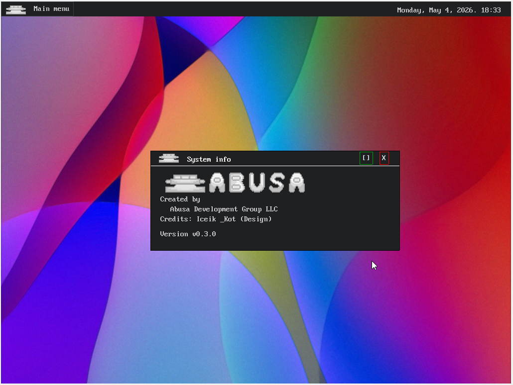
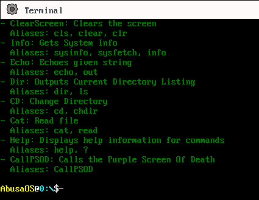
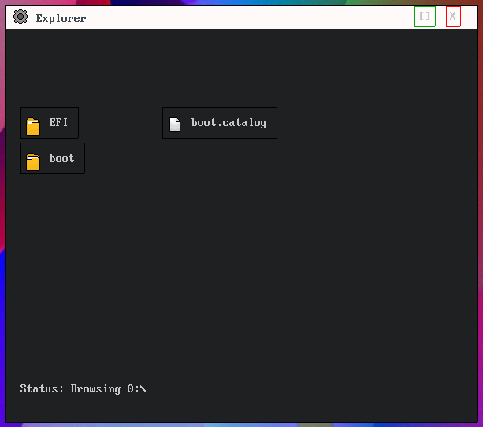

# Abusa OS

`Abusa OS` - экспериментальная операционная система на базе [Cosmos](https://github.com/CosmosOS/Cosmos), написанная на `C#` и `.NET 6.0`.

Проект собирает собственное GUI-окружение с оконным интерфейсом, верхней панелью, главным меню и набором встроенных приложений. Сейчас это пет-проект и площадка для экспериментов.

## Что уже есть

- графическая оболочка на `VBECanvas` с курсором, верхней панелью и главным меню;
- оконная система со встроенными приложениями;
- терминал с командами `help`, `echo`, `cls`, `dir`, `cd`, `cat`, `sysinfo`;
- калькулятор с базовыми операциями, скобками и возможностью извлечь корень;
- файловый менеджер `Explorer`;
- диалоговые окна сообщений и экран критической ошибки;
- фон, логотипы, иконки и звук запуска. Все ресурсы созданы с помощью контрибьюторов или взяты из открытых источников.

## Стек и зависимости

- `C#`
- `.NET 6.0`
- `Cosmos.Build`
- `Cosmos.System2`
- `Cosmos.Debug.Kernel`
- `Cosmos.Plugs`
- `CosmosTTF`
- `XSharp`
- профиль запуска `VMware`

## Структура проекта

- [AbusaOS/Kernel.cs](/C:/Users/2/Desktop/AbusaOS/AbusaOS/Kernel.cs) - инициализация ядра, GUI, приложений и основного цикла.
- [AbusaOS/Windows](/C:/Users/2/Desktop/AbusaOS/AbusaOS/Windows) - окна и встроенные приложения.
- [AbusaOS/Controls](/C:/Users/2/Desktop/AbusaOS/AbusaOS/Controls) - базовые UI-контролы.
- [AbusaOS/Utils/AbusaCLI.cs](/C:/Users/2/Desktop/AbusaOS/AbusaOS/Utils/AbusaCLI.cs) - команды встроенного терминала.
- [AbusaOS/Resource](/C:/Users/2/Desktop/AbusaOS/AbusaOS/Resource) - изображения и звук.
- [AbusaOS/build.bat](/C:/Users/2/Desktop/AbusaOS/AbusaOS/build.bat) - локальная сборка и упаковка ISO.

## Сборка и запуск

### Что нужно

- `Visual Studio 2022`
- `Cosmos User Kit`
- `VMware` для запуска с текущим профилем

### Быстрый старт

1. Восстановите NuGet-пакеты.
2. Соберите проект.
3. Для упаковки ISO используйте [AbusaOS/build.bat](/C:/Users/2/Desktop/AbusaOS/AbusaOS/build.bat), это добавляет логотип проекта в выходной файл.

## Скриншоты

